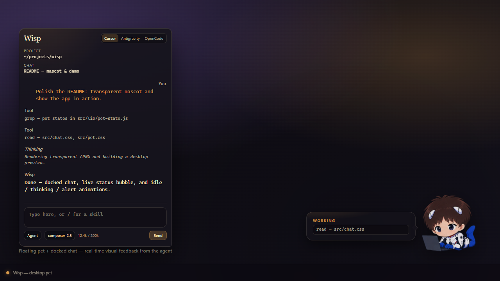

<div align="center">
  
  <h1>Wisp</h1>
  <p><b>Your desktop AI coding companion. Lightweight, draggable, and focused on your workflow.</b></p>

  <p>
    
    
    
    
    
    
  </p>

  <p>
    <a href="#english">English</a> • <a href="#português">Português</a>
  </p>

  <br />

  
</div>

<a id="english"></a>
## English

**Wisp** is a desktop AI companion that lives on your screen as a floating pet. Instead of switching back and forth between browser tabs or keeping terminal windows hidden, you get a lightweight pet sitting in the corner of your screen that visually reacts to whatever the AI agent is doing and opens a docked chat window when clicked.

### The Idea

The goal behind Wisp is straightforward: bring visual presence and quick access to AI coding agents in your daily workflow.

- **Always within reach, never in the way** — Floats transparently on your screen and can be dragged anywhere. Click it to open the docked chat panel; click outside or press `Escape` to tuck it away.
- **Immediate visual feedback** — Glance at the pet and instantly know what the agent is doing without reading logs:
  - **Thinking** — Formulating ideas and reasoning.
  - **Reading / Tools** — Inspecting project files or running terminal commands.
  - **Talking** — Streaming responses into the chat.
  - **Notifying** — Task completed, waiting for interaction.
  - **Sleeping** — Resting idle on your desktop.
  - **Error** — An error occurred during execution.
- **Scoped to your project** — You select your active workspace directory. All file reads, edits, and terminal commands are strictly confined to that folder.
- **Engine freedom** — Wisp does not lock you into a single ecosystem. Switch between backends and providers anytime using the tabs at the top of the chat.
- **Direct passthrough (not a harness)** — Wisp is purely a desktop facilitator to give you full visibility into what the AI is doing in your workflow. It is not and does not try to be an agent harness, test suite, or proxy: at no point does Wisp modify your questions or alter the model's responses. Everything flows directly through the official SDKs and CLIs of each provider (`@cursor/sdk`, `agy`, and `opencode`).

### Supported engines & providers

Wisp lets you switch between three core agent engines seamlessly from the top tabs of the chat. It acts strictly as a lightweight desktop companion — your prompts and answers are never intercepted or altered:

#### 1. Cursor
- **Integration**: Native integration via `@cursor/sdk`.
- **How it works**: Leverages Cursor's agent backend to inspect, read, and edit code within your selected workspace.
- **Supported models**: All cursor avaiable models.
- **Configuration**: Requires a Cursor API key (`cursor.apiKey`), encrypted locally in your OS keyring.

#### 2. Antigravity
- **Integration**: Hybrid — supports both the Google Antigravity CLI (`agy`) and direct Google AI Studio API key.
- **How it works**:
  - **CLI mode (`agy`)**: Connects to the local `agy` process, supporting autonomous task execution, tool calling, subagents, and configurable reasoning effort controls.
  - **Direct API key mode**: Connects straight to the Google Gemini API (via Google AI Studio key), allowing you to chat with Gemini models even without having the `agy` CLI installed.
- **Supported models**: Gemini 3.8 Flash (High/Medium/Low effort), Gemini 3.7 Flash, Gemini 3.1 Pro, Gemini 2.5 Flash/Pro, Claude Sonnet 4.6 (Thinking), Claude Opus 4.6 (Thinking), and GPT-OSS 120B.
- **Configuration**: Use your local `agy` CLI installation or provide a Google AI Studio / Gemini API key (`antigravity.geminiApiKey`).

#### 3. OpenCode
- **Integration**: Subprocess integration via the open-source `opencode` CLI.
- **How it works**: Offers multi-provider flexibility with real-time tool calling, streaming reasoning (*thinking*), and interactive in-chat permission prompts before dangerous operations (file modifications or terminal execution).
- **Supported providers**:
  - **DeepSeek** (`DEEPSEEK_API_KEY`): Deepseek avaiable models.
  - **GLM / Zhipu AI** (`ZAI_API_KEY`): Zhipu AI avaiable models.
  - **Kimi / Moonshot AI** (`MOONSHOT_API_KEY`): Kimi avaiable models.
- **Configuration**: Requires the `opencode` CLI installed on your `PATH` and the respective API key for your chosen provider.

### Where are conversations saved?

Everything is stored **100% locally on your computer**. Wisp never uploads your chat history to any custom backend or cloud server — data only travels directly between your machine and the configured AI provider.

#### Directory locations

| Platform | Path |
| :--- | :--- |
| **Windows** | `%APPDATA%\wisp` (e.g. `C:\Users\<username>\AppData\Roaming\wisp`) |
| **macOS** | `~/Library/Application Support/wisp` |
| **Linux** | `~/.config/wisp` |

#### Files stored in this directory

| File | Description |
| :--- | :--- |
| `config.json` | General settings, active workspace, and encrypted API keys |
| `chats.json` | Conversation history for the Cursor engine |
| `chats-antigravity.json` | Conversation history for the Antigravity engine |
| `chats-opencode.json` | Conversation history for the OpenCode engine |

> **Tip:** To back up or reset your history, simply open that directory and manage the `.json` files.

### Security & key encryption

Your API keys and credentials are never saved in plain text. Wisp implements a multi-layer encryption architecture to protect all secrets at rest:

- **OS-native keyring (Electron `safeStorage`)**: Primary encryption leverages your operating system's native secure credential vault:
  - **Windows**: DPAPI (Data Protection API)
  - **macOS**: Apple Keychain
  - **Linux**: Secret Service API / libsecret / KWallet
- **AES-256-GCM fallback**: If the system vault is unavailable (e.g. headless or unsupported desktop environments), secrets are automatically secured with authenticated `AES-256-GCM` using a machine-and-user-derived key seed.
- **Full engine coverage**: Transparently protects credentials across all backends — Cursor (`cursor.apiKey`), Antigravity / Gemini (`antigravity.geminiApiKey`, `antigravity.apiKey`), and all OpenCode provider keys (`opencode.keys.*`).
- **Memory-only decryption**: Keys remain encrypted on disk in `config.json` (prefixed with `enc:v1:` or `enc:aes:`) and are decrypted strictly in memory when executing API requests.
- **Transparent migration**: Any legacy plain text keys are automatically encrypted the next time settings are saved without requiring manual intervention.

### Operation modes

| Mode | Description | Scope |
| :--- | :--- | :--- |
| **Ask** | Read-only questions and code explanations. Does not touch or modify files. | Read-only |
| **Plan** | Breaks down architecture and implementation steps before running code changes. | Read-only |
| **Agent** | Full autonomous mode with permission to create, edit files, and execute commands in the workspace. | Read / Write / Execute |

### Key features

- **Encrypted credentials** — API keys are encrypted at rest using OS-native vaults (Windows DPAPI, macOS Keychain, Linux Secret Service) with AES-256-GCM fallback.
- **Automatic skills indexing** — Discovers `SKILL.md` files across your project and system directories (`.cursor`, `.agents`, `.claude`, etc.) and lets you invoke them with `/` in the chat.
- **Multiple conversations** — Create, rename, and switch between chat sessions on the fly.
- **Customizable mascot** — Ships with a default Canvas/SVG ghost, but natively supports custom Rive (`.riv`) state machines.
- **Smart window docking** — Chat panel snaps seamlessly beside the pet, adapting across multiple screens and positions.
- **Context meter** — Real-time token tracking relative to the active model's limits.

### The mascot

<div align="center">
  <p><sub><b>In action</b> — floating pet, docked chat, and a live status bubble while the agent works.</sub></p>

  <table>
    <tr>
      <td align="center" width="33%">
        <br>
        <b>Idle</b><br>
        <sub>Waiting on your desktop</sub>
      </td>
      <td align="center" width="33%">
        <br>
        <b>Thinking</b><br>
        <sub>Tools, reading, and reasoning</sub>
      </td>
      <td align="center" width="33%">
        <br>
        <b>Alert</b><br>
        <sub>Task done — waiting for you</sub>
      </td>
    </tr>
  </table>

  <p><sub>Animations rendered from <code>src/mascot.riv</code> (Rive), with a transparent background.</sub></p>
</div>

### Getting started

Requires [Node.js](https://nodejs.org/) installed.

```bash
# Clone the repository
git clone https://github.com/vvieira22/wisp.git
cd wisp

# Install dependencies
npm install

# Start the application
npm start
```

On first launch, click the settings gear in the chat, choose your engine, configure your credentials/paths, and select your project workspace.

### Tested stack (this release)

Versions in [`compat.json`](compat.json) are what this Wisp release was built and smoke-tested against. The app compares your environment at runtime and warns if something differs (especially for the active engine).

| Component | Tested version |
| :--- | :--- |
| Wisp | 0.1.0 |
| @cursor/sdk | 1.0.31 |
| Electron | 44.3.0 |
| Antigravity CLI (`agy`) | 1.2.7 |
| OpenCode CLI (`opencode`) | 1.18.31 |

For maintainers: after bumping dependencies or re-testing CLIs, update `compat.json`, run `npm run check`, and paste `npm run compat:release-notes` into the GitHub release body.

### Useful scripts

- `npm run check` — Runs self-checks for internal modules (includes `compat.json` vs lockfile).
- `npm run compat:release-notes` — Markdown table for GitHub Releases.
- `npm run pack` — Packages the application directory without creating an installer.
- `npm run dist` — Builds installers for your current platform.

### Tech stack

- Electron
- Node.js
- @cursor/sdk
- Google Antigravity CLI (`agy`)
- OpenCode CLI (`opencode`)
- @rive-app/canvas (Rive Runtime)
- HTML5 / CSS / Canvas / SVG

---

<a id="português"></a>
## Português

O **Wisp** é um companheiro de código que fica na sua área de trabalho como um mascote (*desktop pet*). Em vez de ficar alternando entre abas do navegador ou manter janelas de terminal escondidas, você tem um mascote flutuante no canto da tela que reage visualmente ao que o agente de IA está fazendo e abre um painel de chat ao ser clicado.

### A proposta

A ideia do Wisp é simples: trazer presença visual e agilidade ao uso de agentes de IA no dia a dia de desenvolvimento.

- **Sempre à mão sem atrapalhar** — Fica no canto da tela, transparente e arrastável. Clicou nele, o chat abre colado ao mascote; clicou fora ou pressionou `Escape`, ele recolhe.
- **Feedback visual imediato** — Você bate o olho no pet e já sabe o que a IA está fazendo sem precisar ler logs:
  - **Pensando** — Formulando ideias e raciocínio.
  - **Lendo / Ferramentas** — Examinando arquivos do projeto ou rodando comandos no terminal.
  - **Falando** — Escrevendo a resposta no chat.
  - **Notificando** — Tarefa concluída, aguardando você.
  - **Dormindo** — Ocioso no canto da tela.
  - **Erro** — Caso ocorra falha na execução.
- **Você no controle do projeto** — Você seleciona a pasta de trabalho (*workspace*) onde o Wisp deve atuar. Toda leitura, edição de arquivo e execução de comando fica estritamente restrita àquele diretório.
- **Liberdade de motores** — O Wisp não te prende a um único ecossistema. Alterne livremente entre múltiplos motores e provedores a qualquer momento usando as abas no topo do chat.
- **Envio direto (não é um harness)** — O Wisp é apenas um facilitador para você acompanhar visualmente o que a IA está fazendo em qualquer lugar do seu desktop. Ele não é e nem passa perto de ser um harness de testes, proxy ou intermediário: em momento algum altera perguntas do usuário nem respostas do modelo. Tudo utiliza diretamente os SDKs, CLIs e ferramentas oficiais de cada provedor escolhido (`@cursor/sdk`, `agy` e `opencode`).

### Motores e provedores suportados

O Wisp permite alternar entre três motores de agente diretamente pelas abas no topo do chat. Ele atua estritamente como um facilitador visual no desktop — em momento algum mensagens ou respostas sofrem alterações ou intermediações:

#### 1. Cursor
- **Integração**: Nativa via `@cursor/sdk`.
- **Como funciona**: Utiliza o agente na nuvem do Cursor para analisar, ler e editar código dentro da pasta de trabalho selecionada.
- **Modelos suportados**: `composer-2.5`, `composer-1.5`, `claude-3-7-sonnet`, `claude-3-5-sonnet`, `gpt-4o`.
- **Configuração**: Requer chave de API do Cursor (`cursor.apiKey`), criptografada localmente no cofre de credenciais do sistema operacional.

#### 2. Antigravity
- **Integração**: Híbrida — suporta tanto a CLI do Google Antigravity (`agy`) quanto conexão direta por chave de API do Google AI Studio.
- **Como funciona**:
  - **Modo CLI (`agy`)**: Conecta-se ao processo local do `agy`, com suporte a execução autônoma, ferramentas (*tools*), subagentes e ajuste de esforço de raciocínio (*thinking effort*).
  - **Modo API direta**: Comunica-se diretamente com a API do Gemini via chave do Google AI Studio, permitindo usar os modelos mesmo sem ter a CLI `agy` instalada no computador.
- **Modelos suportados**: Família Gemini (Gemini 3.8 Flash em níveis High/Medium/Low, Gemini 3.7 Flash, Gemini 3.1 Pro, Gemini 2.5 Flash/Pro), Claude Sonnet 4.6 (Thinking), Claude Opus 4.6 (Thinking) e GPT-OSS 120B.
- **Configuração**: Utilize sua instalação local da CLI `agy` ou informe diretamente a chave de API do Gemini / Google AI Studio (`antigravity.geminiApiKey`).

#### 3. OpenCode
- **Integração**: Execução de subprocesso via CLI open-source do `opencode`.
- **Como funciona**: Oferece flexibilidade multi-provedor com execução de ferramentas em tempo real, streaming de raciocínio (*thinking*) e diálogo interativo de permissões no chat antes de operações sensíveis (edição de arquivos ou execução no terminal).
- **Provedores suportados**:
  - **DeepSeek** (`DEEPSEEK_API_KEY`): DeepSeek-V3 e DeepSeek-R1, com suporte a ligar/desligar modo de raciocínio (*thinking*).
  - **GLM / Zhipu AI** (`ZAI_API_KEY`): Modelos GLM-4 e variantes de raciocínio da Zhipu AI.
  - **Kimi / Moonshot AI** (`MOONSHOT_API_KEY`): Modelos com janela de contexto estendida da Moonshot.
- **Configuração**: Requer a CLI `opencode` instalada no `PATH` e a chave de API referente ao provedor escolhido.

### Onde as conversas são salvas?

Tudo é armazenado **100% localmente no seu computador**. O Wisp não envia seu histórico para servidores em nuvem ou bancos de dados externos — o tráfego acontece apenas diretamente entre a sua máquina e a API do provedor configurado.

#### Locais de armazenamento

| Plataforma | Caminho |
| :--- | :--- |
| **Windows** | `%APPDATA%\wisp` (ex.: `C:\Users\<seu-usuario>\AppData\Roaming\wisp`) |
| **macOS** | `~/Library/Application Support/wisp` |
| **Linux** | `~/.config/wisp` |

#### Arquivos armazenados nesta pasta

| Arquivo | Descrição |
| :--- | :--- |
| `config.json` | Configurações gerais, workspace ativo e chaves de API criptografadas |
| `chats.json` | Histórico de conversas do motor Cursor |
| `chats-antigravity.json` | Histórico de conversas do motor Antigravity |
| `chats-opencode.json` | Histórico de conversas do motor OpenCode |

> **Dica:** Para fazer backup ou limpar seu histórico, basta abrir essa pasta e gerenciar os arquivos `.json`.

### Segurança e criptografia de chaves

Suas chaves de API e credenciais nunca ficam salvas em texto puro. O Wisp possui uma arquitetura de criptografia em repouso com múltiplas camadas:

- **Cofre nativo do sistema operacional (Electron `safeStorage`)**: Criptografia primária gerenciada pelo cofre seguro nativo do seu SO:
  - **Windows**: DPAPI (Data Protection API)
  - **macOS**: Apple Keychain
  - **Linux**: Secret Service API / libsecret / KWallet
- **Fallback com AES-256-GCM**: Caso o cofre nativo do sistema esteja inacessível (ex.: ambientes headless ou sem backend de segredos configurado), as chaves são protegidas automaticamente com `AES-256-GCM` autenticado usando semente derivada da máquina e usuário.
- **Cobertura total de motores**: Protege de ponta a ponta as credenciais de todos os motores suportados — Cursor (`cursor.apiKey`), Antigravity / Gemini (`antigravity.geminiApiKey`, `antigravity.apiKey`) e chaves de provedores do OpenCode (`opencode.keys.*`).
- **Descriptografia apenas em memória**: As chaves ficam salvas no arquivo `config.json` com prefixos cifrados (`enc:v1:` ou `enc:aes:`) e são abertas exclusivamente na memória RAM no momento de executar as chamadas de API.
- **Migração transparente**: Chaves legadas existentes em texto puro são convertidas para o formato cifrado automaticamente na próxima gravação, sem requerer intervenção manual.

### Modos de operação

| Modo | Descrição | Permissões |
| :--- | :--- | :--- |
| **Perguntar** | Tira dúvidas e analisa arquivos para explicar o código. Não altera arquivos nem roda comandos. | Somente leitura |
| **Plano** | Estrutura passos e estratégias de arquitetura antes de qualquer execução prática. | Somente leitura |
| **Agente** | Modo de desenvolvimento completo, com permissão para criar, editar arquivos e rodar comandos no workspace. | Leitura / Escrita / Execução |

### Recursos

- **Credenciais criptografadas** — Chaves de API armazenadas em disco sob criptografia nativa do SO (DPAPI, Keychain, Secret Service) com fallback AES-256-GCM.
- **Skills automáticas** — Detecta automaticamente arquivos `SKILL.md` existentes no projeto ou no sistema (pastas `.cursor`, `.agents`, `.claude`, etc.) e permite ativá-las usando `/` no chat.
- **Múltiplas conversas** — Crie novas conversas, renomeie ou alterne entre sessões a qualquer momento.
- **Mascote personalizável** — Vem por padrão com um fantasma animado em SVG/Canvas, com suporte nativo a arquivos Rive (`.riv`) com máquina de estados.
- **Janela acoplada** — O painel de chat se posiciona e se ajusta automaticamente ao lado do mascote em qualquer monitor.
- **Monitor de contexto** — Contador visual de tokens consumidos no turno em relação ao limite do modelo.

### Como rodar

Requer o [Node.js](https://nodejs.org/) instalado.

```bash
# Clone o repositório
git clone https://github.com/vvieira22/wisp.git
cd wisp

# Instale as dependências
npm install

# Inicie o aplicativo
npm start
```

Na primeira inicialização, clique na engrenagem no chat (configurações), escolha seu motor de IA, informe as chaves ou caminhos necessários e selecione a pasta do projeto em que deseja trabalhar.

### Stack testado (esta release)

As versões em [`compat.json`](compat.json) são as usadas no build e no smoke test desta release do Wisp. O app compara seu ambiente em tempo de execução e avisa se algo diverge (principalmente no motor ativo).

| Componente | Versão testada |
| :--- | :--- |
| Wisp | 0.1.0 |
| @cursor/sdk | 1.0.31 |
| Electron | 44.3.0 |
| CLI Antigravity (`agy`) | 1.2.7 |
| CLI OpenCode (`opencode`) | 1.18.31 |

Manutenção: ao atualizar dependências ou re-testar CLIs, atualize `compat.json`, rode `npm run check` e cole `npm run compat:release-notes` na descrição do release no GitHub.

### Scripts úteis

- `npm run check` — Executa as validações e testes rápidos das bibliotecas internas (inclui `compat.json` vs lockfile).
- `npm run compat:release-notes` — Tabela em Markdown para GitHub Releases.
- `npm run pack` — Compila a aplicação localmente sem empacotar instalador.
- `npm run dist` — Gera os instaladores para o sistema operacional atual.

### Tecnologias

- Electron
- Node.js
- @cursor/sdk
- Google Antigravity CLI (`agy`)
- OpenCode CLI (`opencode`)
- @rive-app/canvas (Rive Runtime)
- HTML5 / CSS / Canvas / SVG
