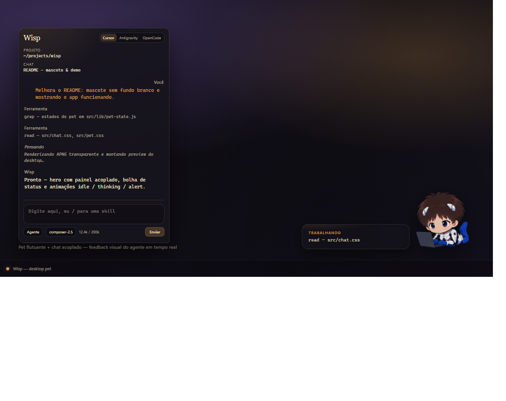

<div align="center">
  
  <h1>Wisp</h1>
  <p><b>Your desktop AI coding companion. Lightweight, draggable, and focused on your workflow. Bring a powerful AI agent to any screen, designed to enhance your workflow and maximize productivity.</b></p>

  <p>
    
    
    
    
    
    
  </p>

  <br />

  
</div>

<a id="english"></a>
## English


**Wisp** was born to solve a daily friction: using AI coding agents freely without fighting your window layout or breaking your flow.

Instead of sacrificing screen space to bloated sidebars, constantly juggling browser tabs, or Alt-Tabbing back and forth to check hidden terminal outputs, Wisp lives as a lightweight, floating desktop pet. It sits quietly alongside your code editor, browser, terminal, and documentation, giving you instant visual feedback on what the agent is doing and letting you chat with it on demand. When you're done, a single click outside or `Escape` key tucks it away completely — leaving your screen 100% yours.

### Why Wisp?

The motivation is simple: AI should adapt to your workspace, not force you to rearrange it.

- **Multitask freely alongside your windows** — Keep coding in your IDE, reading docs, or running tests while Wisp floats in the corner, never stealing your focus or window estate.
- **Always within reach, never in the way** — Fully draggable, transparent, and dockable. Click the pet to pull up the chat; press `Escape` or click away to tuck it back.
- **Immediate visual feedback** — Glance at the pet and instantly know what the agent is doing without reading logs:
  - **Thinking** — Formulating ideas and reasoning.
  - **Reading / Tools** — Inspecting project files or running terminal commands.
  - **Talking** — Streaming responses into the chat.
  - **Notifying** — Task completed, waiting for interaction.
  - **Sleeping** — Resting idle on your desktop.
  - **Error** — An error occurred during execution.
- **Scoped to your project** — You select your active workspace directory. All file reads, edits, and terminal commands are strictly confined to that folder.
- **Engine freedom** — Wisp does not lock you into a single ecosystem. Switch between backends and providers anytime using the tabs at the top of the chat.
- **Direct passthrough (not a harness)** — Wisp is purely a desktop facilitator to give you full visibility into what the AI is doing in your workflow. It is not and does not try to be an agent harness, test suite, or proxy: at no point does Wisp modify your questions or alter the model's responses. Everything flows directly through the official SDKs and CLIs of each provider (`@cursor/sdk`, `agy`, and `opencode`).

### Supported engines & providers

Wisp lets you switch between three core agent engines seamlessly from the top tabs of the chat. It acts strictly as a lightweight desktop companion — your prompts and answers are never intercepted or altered:

#### 1. Cursor
- **Integration**: Native integration via `@cursor/sdk`.
- **How it works**: Leverages Cursor's agent backend to inspect, read, and edit code within your selected workspace.
- **Supported models**: All Cursor available models.
- **Configuration**: Requires a Cursor API key (`cursor.apiKey`), encrypted locally in your OS keyring.

#### 2. Antigravity
- **Integration**: Hybrid — supports both the Google Antigravity CLI (`agy`) and direct Google AI Studio API key.
- **How it works**:
  - **CLI mode (`agy`)**: Connects to the local `agy` process, supporting autonomous task execution, tool calling, subagents, and configurable reasoning effort controls.
  - **Direct API key mode**: Connects straight to the Google Gemini API (via Google AI Studio key), allowing you to chat with Gemini models even without having the `agy` CLI installed.
- **Supported models**: Gemini 3.8 Flash (High/Medium/Low effort), Gemini 3.7 Flash, Gemini 3.1 Pro, Gemini 2.5 Flash/Pro, Claude Sonnet 4.6 (Thinking), Claude Opus 4.6 (Thinking), and GPT-OSS 120B.
- **Configuration**: Use your local `agy` CLI installation or provide a Google AI Studio / Gemini API key (`antigravity.geminiApiKey`).

#### 3. OpenCode
- **Integration**: Subprocess integration via the open-source `opencode` CLI.
- **How it works**: Offers multi-provider flexibility with real-time tool calling, streaming reasoning (*thinking*), and interactive in-chat permission prompts before dangerous operations (file modifications or terminal execution).
- **Supported providers**:
  - **DeepSeek** (`DEEPSEEK_API_KEY`): DeepSeek available models.
  - **GLM / Zhipu AI** (`ZAI_API_KEY`): Zhipu AI available models.
  - **Kimi / Moonshot AI** (`MOONSHOT_API_KEY`): Kimi available models.
- **Configuration**: Requires the `opencode` CLI installed on your `PATH` and the respective API key for your chosen provider.

### Where are conversations saved?

Everything is stored **100% locally on your computer**. Wisp never uploads your chat history to any custom backend or cloud server — data only travels directly between your machine and the configured AI provider.

#### Directory locations

| Platform | Path |
| :--- | :--- |
| **Windows** | `%APPDATA%\wisp` (e.g. `C:\Users\<username>\AppData\Roaming\wisp`) |
| **macOS** | `~/Library/Application Support/wisp` |
| **Linux** | `~/.config/wisp` |

#### Files stored in this directory

| File | Description |
| :--- | :--- |
| `config.json` | General settings, active workspace, and encrypted API keys |
| `chats.json` | Conversation history for the Cursor engine |
| `chats-antigravity.json` | Conversation history for the Antigravity engine |
| `chats-opencode.json` | Conversation history for the OpenCode engine |

> **Tip:** To back up or reset your history, simply open that directory and manage the `.json` files.

### Security & key encryption

Your API keys and credentials are never saved in plain text. Wisp implements a multi-layer encryption architecture to protect all secrets at rest:

- **OS-native keyring (Electron `safeStorage`)**: Primary encryption leverages your operating system's native secure credential vault:
  - **Windows**: DPAPI (Data Protection API)
  - **macOS**: Apple Keychain
  - **Linux**: Secret Service API / libsecret / KWallet
- **AES-256-GCM fallback**: If the system vault is unavailable (e.g. headless or unsupported desktop environments), secrets are automatically secured with authenticated `AES-256-GCM` using a machine-and-user-derived key seed.
- **Full engine coverage**: Transparently protects credentials across all backends — Cursor (`cursor.apiKey`), Antigravity / Gemini (`antigravity.geminiApiKey`, `antigravity.apiKey`), and all OpenCode provider keys (`opencode.keys.*`).
- **Memory-only decryption**: Keys remain encrypted on disk in `config.json` (prefixed with `enc:v1:` or `enc:aes:`) and are decrypted strictly in memory when executing API requests.
- **Transparent migration**: Any legacy plain text keys are automatically encrypted the next time settings are saved without requiring manual intervention.

### Operation modes

| Mode | Description | Scope |
| :--- | :--- | :--- |
| **Ask** | Read-only questions and code explanations. Does not touch or modify files. | Read-only |
| **Plan** | Breaks down architecture and implementation steps before running code changes. | Read-only |
| **Agent** | Full autonomous mode with permission to create, edit files, and execute commands in the workspace. | Read / Write / Execute |

### Key features

- **Encrypted credentials** — API keys are encrypted at rest using OS-native vaults (Windows DPAPI, macOS Keychain, Linux Secret Service) with AES-256-GCM fallback.
- **Workspace-isolated history** — Conversations are organized per workspace folder; switching projects instantly restores relevant threads without mixing history, with support for quick conversation deletion.
- **Message queuing & multi-tasking** — Send messages while the agent is busy to queue them naturally; the desktop pet and chat header show live counters for parallel running tasks.
- **Automatic skills indexing** — Discovers `SKILL.md` files across your project and system directories (`.cursor`, `.agents`, `.claude`, etc.) and lets you invoke them with `/` in the chat.
- **Multiple conversations** — Create, rename, delete, and switch between chat sessions on the fly.
- **Customizable mascot** — Ships with a default Canvas/SVG ghost, but natively supports custom Rive (`.riv`) state machines.
- **Smart window docking** — Chat panel snaps seamlessly beside the pet, adapting across multiple screens and positions.
- **Context meter** — Real-time token tracking relative to the active model's limits.

### The mascot

<div align="center">
  <p><sub><b>In action</b> — floating pet, docked chat, and a live status bubble while the agent works.</sub></p>

  <table>
    <tr>
      <td align="center" width="33%">
        <br>
        <b>Idle</b><br>
        <sub>Waiting on your desktop</sub>
      </td>
      <td align="center" width="33%">
        <br>
        <b>Thinking</b><br>
        <sub>Tools, reading, and reasoning</sub>
      </td>
      <td align="center" width="33%">
        <br>
        <b>Alert</b><br>
        <sub>Task done — waiting for you</sub>
      </td>
    </tr>
  </table>

  <p><sub>Animations rendered from <code>src/mascot.riv</code> (Rive), with a transparent background.</sub></p>
</div>

### Getting started

Requires [Node.js](https://nodejs.org/) installed.

```bash
# Clone the repository
git clone https://github.com/vvieira22/wisp.git
cd wisp

# Install dependencies
npm install

# Start the application
npm start
```

On first launch, click the settings gear in the chat, choose your engine, configure your credentials/paths, and select your project workspace.

### Tested stack (this release)

Versions in [`compat.json`](compat.json) are what this Wisp release was built and smoke-tested against. The app compares your environment at runtime and warns if something differs (especially for the active engine).

| Component | Tested version |
| :--- | :--- |
| Wisp | 1.1.0 |
| @cursor/sdk | 1.0.31 |
| Electron | 44.3.0 |
| Antigravity CLI (`agy`) | 1.2.7 |
| OpenCode CLI (`opencode`) | 1.18.31 |

For maintainers: after bumping dependencies or re-testing CLIs, update `compat.json`, run `npm run check`, and paste `npm run compat:release-notes` into the GitHub release body.

### Useful scripts

- `npm run check` — Runs self-checks for internal modules (includes `compat.json` vs lockfile).
- `npm run compat:release-notes` — Markdown table for GitHub Releases.
- `npm run pack` — Packages the application directory without creating an installer.
- `npm run dist` — Builds installers for your current platform.

### Tech stack

- Electron
- Node.js
- @cursor/sdk
- Google Antigravity CLI (`agy`)
- OpenCode CLI (`opencode`)
- @rive-app/canvas (Rive Runtime)
- HTML5 / CSS / Canvas / SVG